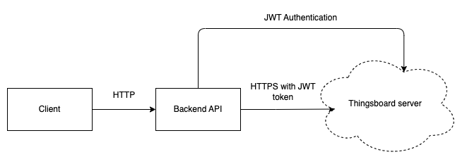

IOT Client-Backend-Thingsboard server integration
==

# Overview

This is a client-backend-Thingsboard server integration of an IOT device.

# Quick Start

Just execute `make serve` to serve the program via docker (Be sure to have `/backend/.env.dist` file updated).

# Features

A node express app with REST endpoints that will interact with a Thinsgboard server and respond appropriately to client:

- Endpoint for device creation
- Endpoint for device deletion
- Endpoint for uploading telemetry
- Endpoint for downloading telemetry: returns the aggregated (SUM per hour) telemetry data from a specific device
  Client application

A node app that makes use of the backend API that created by:
- Creating a device
- Uploading telemetry data

## Tech Stack

| Type              | Item       | Version |
|-------------------|------------|---------|
| Client Language   | Javascript | v19     |
| Client Framework  | Native     |         |
| BackEnd Language  | Javascript | v19     |
| BackEnd Framework | ExpressJS  | v4      |

## External Services

| Type | Provider    | Version | Purpose    |
|------|-------------|---------|------------|
| HTTP | Thingsboard | v3      | IOT Server |

# API

## HTTP

Postman Collection Location: _under `doc/postman/`_

# Developers Handbook

## Build and Run

Please use `make <target>` where `<target>` is one of the following:

``` makefile
`serve`                          Serve the backend app with Docker Compose
`serve-client`                   Serve the client app with Docker Compose
`stop`                           Stop the Docker Compose app
```

[//]: # (There is a second makefile at the `backend` directory which provides some extra functionalities such as linting,)

[//]: # (testing,)

[//]: # (ci, etc..:)

[//]: # ()

[//]: # (``` makefile)

[//]: # (`serve`                          Serve the app with Docker Compose)

[//]: # (`ci`                             Run the CI pipeline)

[//]: # (`stop`                           Stop the Docker Compose app)

[//]: # (`test`                           Run the tests)

[//]: # (```)

# Technical Details

## Technical Overview



## What has been implemented

- [ ] Unit testing.
- [x] Integration testing.
- [x] Use of route-controller-service pattern.
- [x] Thingsboard JWT authentication.
- [ ] JWT token refreshing.
- [x] Postman collection.
- [x] Docker implementation.

## Future Improvements

- Use of a proper logger.
- Use of a proper error handler.
- Use of a proper config manager.
- Add validators for validating user input.
